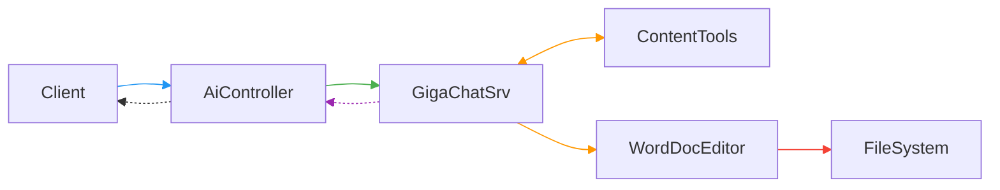
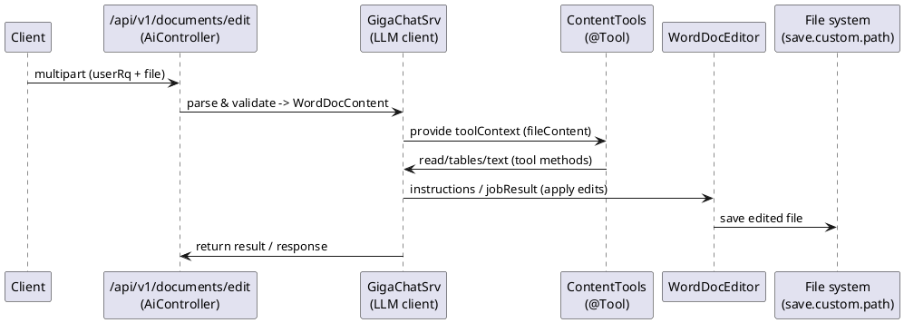

# ai-agent-doc-edit

Приложение для AI анализа и редактирования Word-отчётов с помощью LLM (Gigachat) и локальных инструментов обработки документа.

## 1. Бизнес проблема:

Организации часто имеют отчёты в формате Word, которые требуют массовых правок, согласований или извлечения структурированных данных (таблицы, ячейки). 
Ручная обработка таких документов требует времени и уязвима к ошибкам; интеграция с LLM позволяет формулировать правки на естественном языке, 
но требует безопасного механизма передачи контекста и применения изменений в исходном документе.

## 2. Решение (Architecture & Solution)

Проект реализует серверное Spring Boot приложение, которое:
- Принимает multipart-запросы с файлом Word и JSON-запросом пользователя.
- Парсит и валидирует содержимое документа (текст, таблицы) в модель `WordDocContent`.
- Формирует контекст и вызывает LLM через Spring AI (`GigaChatSrv`).
- Предоставляет LLM набор локальных инструментов (`@Tool` в `ContentTools`) для безопасного доступа к структуре документа и применения правок.
- После получения результата редактор (`WordDocEditor`) вносит правки в Word-файл и сохраняет итог.

Ключевые компоненты:
- Контроллер: `AiController` — точка входа HTTP API.
- Сервис LLM: `GigaChatSrv` — обёртка над `ChatClient`.
- Инструменты (tools): `ContentTools` — методы, доступные модели для чтения/модификации контента.
- Редактор: `WordDocEditor` — применяет изменения в DOCX через Apache POI.

Диаграмма вызовов и взаимодействия компонентов:

## 3. Техническая реализация (коротко)

- Формат входа: multipart/form-data: JSON с запросом к LLM и файл Word для передачи в контекст.
- Tool-context: `fileContent: WordDocContent` передаётся в LLM, чтобы локальные `@Tool` могли возвращать структурированные данные (списки таблиц, ячеек и т.д.).
- Применение изменений: LLM ищет и исправляет ошибки, возвращает JSON с результатом работы, который используется `WordDocEditor` для преобразования в конкретные операции Apache POI (замены текста, правка ячеек таблиц).
- После `WordDocEditor` сохраняет исправленный документ.

## 4. Стек технологий:

- Язык: Java 17
- Фреймворк: Spring Boot 3.x
- LLM-интеграция: Spring AI (Gigachat starter)
- Работа с Word: Apache POI (poi, poi-ooxml)
- JSON: Jackson
- Lombok для логов/снижения шаблонного кода
- Сборка: Maven

## 5. Ссылки:
- Демо-видео работы агента: https://t.me/ai_alchemy2025/10
